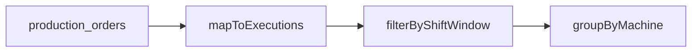

# Shift-Based Schedule Gantt

## Scope

- Add a new Gantt section above the existing execution lists on the Schedule page.
- Use hardcoded shift boundaries for now (06:00–14:00, 14:00–22:00, 22:00–06:00).
- Render execution-per-machine bars sourced from `production_orders` with live end-time for RUNNING.

## Data Mapping

- Source executions from [`src/hooks/useProductionData.ts`](src/hooks/useProductionData.ts) via `useProductionOrders()`.
- Bar fields:
  - start: `order.startTime`
  - end: `order.endTime` or `now` if `order.status === 'running'`
  - label: `order.productNameCurrent ?? order.productName`
  - status: `order.status`
  - machine: `order.machineName ?? order.machineId`

## UI Structure

- In [`src/components/tabs/ProductionSchedule.tsx`](src/components/tabs/ProductionSchedule.tsx), insert a new “Shift Gantt” section before the current running/interrupted/completed lists.
- Each shift lane contains machine rows with bars for executions that overlap the shift window.
- Keep existing summary cards and execution lists intact below.

## Implementation Steps

1. Add a shift utility in `ProductionSchedule`:

   - Define shift windows for the current day and handle the overnight shift.
   - Build a function to clip order ranges to shift window for bar width.

2. Build the Gantt layout in `ProductionSchedule`:

   - For each shift, group orders by machine name.
   - Render a machine row label + a timeline row with bars positioned by time percentage within the shift.

3. Styling and status colors:

   - RUNNING / COMPLETED / INTERRUPTED colors consistent with existing status styling.
   - Show product label on bar (truncate) and tooltip on hover for full label.

4. Real-time refresh:

   - Use a local `now` state updated on interval (e.g., 30s) so RUNNING bars grow.

## Minimal helper diagram

## Files to change

- [`src/components/tabs/ProductionSchedule.tsx`](src/components/tabs/ProductionSchedule.tsx)

## Non-goals

- No planning view.
- No backend changes in this step.