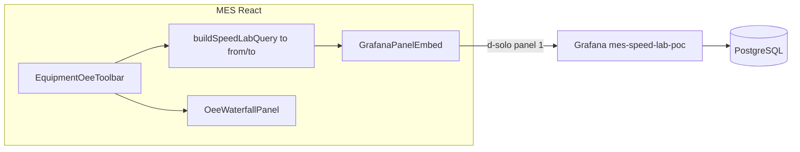

# Quyết định nhúng Grafana vào MES (Phase 2)

Tài liệu này ghi **kết luận sau POC** — dùng cùng metric từ [`MES_BASELINE_RESULTS.md`](MES_BASELINE_RESULTS.md) và dashboard [`grafana/dashboards/mes-speed-lab-poc.json`](../../grafana/dashboards/mes-speed-lab-poc.json).

## Tiêu chí quyết định

| Tiêu chí | Ngưỡng embed | Ngưỡng giữ MES |
|----------|--------------|----------------|
| Panel query / API | ≤ 2s p95 | > 5s hoặc logic không map SQL |
| Payload | Aggregate < 100 KB | Raw > 500 KB |
| UX | Historical, zoom range | Realtime < 30s, tương tác PO/bobbin |
| Bảo trì | SQL ổn định, 1 nguồn bảng | Business rule đổi thường xuyên |

## Ma trận quyết định

| Thành phần | Trang | Embed Grafana? | Lý do |
|------------|-------|----------------|-------|
| **Speed trend (historical)** | Speed Lab, Equipment Detail | **Có — ưu tiên cao** | SQL bucket trên `oee_calculations` đơn giản; Grafana time picker linh hoạt hơn 11 mode toolbar |
| **Energy bar (giờ/ngày)** | Equipment Detail | **Có — ưu tiên trung bình** | `energy_consumption` hourly; chart React đang filter client từ poll 14 ngày |
| **Multi-machine speed compare** | Speed Lab (chưa dùng UI) | **Có — sau POC** | Panel Grafana + variable multi-select; thay `query-multi` |
| **OEE Waterfall v2** | Speed Lab | **Không** | Logic `waterfall_shift_v2_performance_ils` trong `oeeWaterfallService.js` — không replicate SQL thuần |
| **Gantt + product notes** | Speed Lab, Equipment | **Không (giai đoạn 1)** | Cần `production_orders` overlay + phase màu; State timeline Grafana chỉ gần đúng |
| **Realtime 5 phút** (temp/speed/current) | Equipment Detail | **Không** | Poll ~1s + WebSocket; Grafana refresh 30s không đủ |
| **OEE KPI rollup / past_shift settled** | Equipment Detail | **Không** | Phụ thuộc `analytics_cache`, `oee_shift_settlements`, JWT |
| **Order / bobbin history** | Equipment Detail | **Không** | Transactional UI, không time-series |

## Kiến trúc embed đề xuất (khi POC đạt ngưỡng)

### Mapping filter MES → Grafana URL

| `EquipmentOeeMode` | Grafana `from` / `to` |
|--------------------|------------------------|
| `shift_1/2/3`, `past_shift` | ICT shift start/end từ `getShiftWindow` |
| `day`, `yesterday`, `calendar_day` | `getProductionDayWindow` |
| `week` | `now-7d` / `now` |
| `realtime`, `shift_live` | Ca hiện tại → `now` |

Component đề xuất (Phase 2 code): `GrafanaPanelEmbed.tsx` — nhận `panelId`, `from`, `to`, `var-machine_id`.

### Auth embed

1. **Nội bộ LAN:** Grafana anonymous Viewer + reverse proxy chỉ LAN.
2. **Production:** Service account token qua backend proxy (không lộ token ra browser).
3. **Không** dùng Grafana MCP / Assistant cho operator runtime.

## Fallback không cần Grafana

Nếu POC không đạt ngưỡng hoặc không muốn ops Grafana:

1. `includeSegments=false` mặc định trên Speed Lab API.
2. Thêm `custom_range` + datetime picker vào `EquipmentOeeToolbar`.
3. Cache server theo `rangeKey` (Redis hoặc `analytics_cache` pattern).

Chi phí dev ước tính thấp hơn embed Grafana nhưng thiếu ad-hoc analytics và alert.

## Checklist trước khi embed

- [ ] POC scenario B: Grafana Σ SQL ms < MES T_total
- [ ] Theme Grafana dark gần MES (`speed-lab.css`)
- [ ] SSO hoặc proxy auth
- [ ] `grafana_readonly` không dùng superuser
- [ ] Retention `oee_calculations` đã có kế hoạch — xem [`RETENTION_PLAN.md`](RETENTION_PLAN.md)

## Kết luận sau baseline (SH-08, 2026-06-25)

| Scenario | MES T_total | MES payload | Grafana Σ SQL | Embed? |
|----------|-------------|-------------|---------------|--------|
| A — 1 ca | 58 ms | 9 KB | 103 ms | Giữ MES (đủ nhanh) |
| B — 1 ngày | 23 ms | 3 KB | 2 ms | Giữ MES |
| **C — 7 ngày** | **745 ms** | **4948 KB** | **310 ms** | **Ưu tiên Grafana** cho speed historical |

Scenario C: `speedLabQuery` chiếm 721 ms / 4905 KB do `includeRaw=1` + segment series (~21k rows). Grafana aggregate cùng range chỉ ~81 bucket points — **lợi thế rõ ràng** cho embed speed panel.

| Panel | Embed? | Ghi chú |
|-------|--------|---------|
| Speed trend (range > 24h) | **Có** | Grafana 310 ms vs MES 745 ms + 4.8 MB |
| Speed trend (≤ 1 ca) | Giữ MES | 58 ms, cần overlay ICT/PO notes |
| Energy | **Có** | SQL hourly 0–3 ms; giảm poll 14d |
| Status Gantt | **Giữ MES** | Grafana state timeline thiếu PO notes |
| Waterfall | **Giữ MES** | Business logic độc quyền API |
