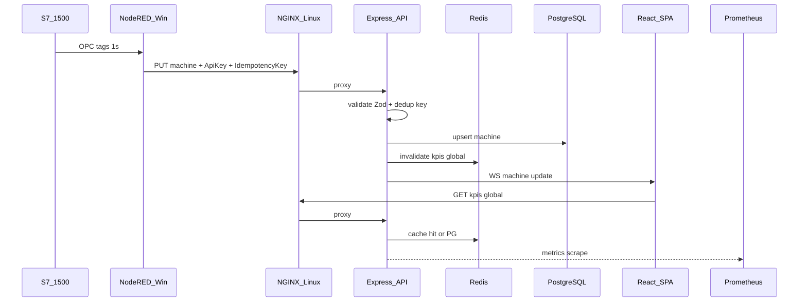

# SKILL_BATTLEMAP — MES Production Dashboard

> **Mục đích**: Bản đồ công nghệ thực chiến — biết *khi nào dùng gì*, tránh over-engineering.
> **Dự án**: Production Overview Dashboard (React + Express + PostgreSQL + Node-RED + S7-1500)
> **Kiến trúc deploy**: Hybrid — MES app trên **Linux**, OT gateway trên **Windows**
> **Cập nhật**: 2026-09-01 · Phase 0 Session 0A

---

## 1. Tóm tắt kiến trúc hiện tại vs mục tiêu

### Hiện tại (baseline)

```
S7-1500 → Node-RED (Windows) → REST API (Express :3001) → PostgreSQL → React SPA
                                      ↓
                              WebSocket /ws (optional)
Deploy: NGINX + PM2 trên Windows ([README-deploy.md](../../README-deploy.md))
Grafana: POC có sẵn ([docker-compose.grafana.yml](../../docker-compose.grafana.yml))
Cache: analytics_cache trong PostgreSQL (chưa có Redis)
Auth: JWT một phần; ingestion API chưa có API key / idempotency
Observability: console.log; /health + /health/ready có sẵn
```

### Mục tiêu (12 tháng)

```
S7-1500 → Node-RED (Win) ──API Key + Idempotency-Key──┐
                                                       ↓
React ← NGINX (LB + static cache) ← Express × N ← Redis (cache + queue)
                                       ↓                    ↓
                                  PostgreSQL            BullMQ workers
                                       ↓
                              Prometheus → Grafana (MES + Server Health)
                                       ↓
                              pino logs → journalctl / Loki
Phase 6: OAuth SSO (optional) · LLM+RAG (docs nội bộ only)
```

---

## 2. Ma trận skill — Khi nào dùng?

| # | Skill | Dùng khi | KHÔNG dùng khi | Phase |
|---|-------|----------|----------------|-------|
| 1 | **JWT** | Auth user FE, service token ngắn hạn | Thay API key cho OT ingestion | 2 |
| 2 | **OAuth2/OIDC** | SSO công ty (Entra/Keycloak) | Chỉ 5 user nội bộ, chưa có IdP | 5–6 |
| 3 | **Idempotency Key** | PLC/Node-RED retry, network flap | GET read-only | 2–3 |
| 4 | **Caching (Redis)** | KPI poll 2s, analytics 5 phút, hot path | Data thay đổi mỗi request, chưa có baseline | 3 |
| 5 | **Message Queue** | Burst 100 lines, OEE recalc nặng | < 10 req/s, job < 500ms | 3–5 |
| 6 | **Load Balancing** | > 1 backend replica, HA | Single instance đủ, chưa load test | 4 |
| 7 | **CDN** | Static FE global, remote user | Factory LAN only, NGINX gzip đủ | 4 |
| 8 | **Prometheus** | SLO latency, error rate, capacity plan | Chưa có /health baseline | 2–3 |
| 9 | **Grafana** | Dashboard ops + MES KPI | Chỉ cần 1 chart trong React | 0–3 |
| 10 | **Log aggregation** | Debug production, audit | Dev local console.log | 2–3 |
| 11 | **LLM + RAG** | Tra cứu OEE rulebook, runbook | Real-time OT control, gửi PLC tags ra ngoài | 6 |

**Quy tắc vàng**: Measure baseline Phase 0 → thêm 1 skill/sprint → benchmark lại.

---

## 3. Chi tiết từng skill + map vào MES

### 3.1 JWT (JSON Web Token)

**Là gì**: Token signed (HS256/RS256) chứa claims (`sub`, `role`, `exp`). Server verify signature, không cần session store.

**Trong MES hiện tại**:

- Login: `POST /api/auth/login` → token 24h
- FE lưu `localStorage["mes_login_session"]` — XSS risk (Phase 4: httpOnly cookie hoặc refresh flow)
- Ingestion Node-RED: doc yêu cầu JWT nhưng code **chưa enforce** trên `PUT /api/machines/name/:machineName`

**Pattern mục tiêu (Phase 2)**:

```
Access token:  15 phút  → Authorization: Bearer <token>
Refresh token: 7 ngày   → POST /api/auth/refresh (httpOnly cookie)
OT ingestion:  API key    → X-MES-Ingest-Key (không dùng JWT user token)
```

**MES use case**:

| Actor | Auth method |
|-------|-------------|
| Operator/Engineer (browser) | JWT access + refresh |
| Node-RED gateway | API key + Idempotency-Key |
| WebSocket /ws | Token query param hoặc first message |

**Học thêm**: [jwt.io](https://jwt.io) decode · OWASP JWT cheat sheet

---

### 3.2 OAuth2 / OIDC (Phase 5–6, optional)

**Là gì**: Delegate identity cho IdP (Microsoft Entra, Keycloak). App nhận `code` → exchange → JWT nội bộ.

**Khi nào cần**: Công ty có Azure AD, > 20 user, policy MFA/password central.

**MES pattern**:

```
Browser → Entra login → NGINX auth_request / OAuth callback
       → Backend phát JWT nội bộ (giữ role mes_users)
OT path: KHÔNG qua OAuth — vẫn API key
```

**Không thay thế**: API key cho Node-RED (machine-to-machine).

---

### 3.3 Idempotency Key

**Là gì**: Client gửi header `Idempotency-Key: <uuid>` — server xử lý 1 lần, retry trả cùng response.

**Tại sao MES cần**: Node-RED timeout → retry → duplicate telemetry / double OEE nếu không dedup.

**Implement (Phase 2–3)**:

```sql
CREATE TABLE ingestion_dedup (
  idempotency_key VARCHAR(64) PRIMARY KEY,
  endpoint        VARCHAR(128) NOT NULL,
  response_hash   VARCHAR(64),
  created_at      TIMESTAMPTZ DEFAULT NOW()
);
-- TTL cleanup: DELETE WHERE created_at < NOW() - INTERVAL '24 hours'
```

**Flow**:

```
Node-RED: key = hash(machineName + timestamp_bucket + payload_version)
PUT /api/machines/name/DA13
  Headers: X-MES-Ingest-Key, Idempotency-Key
Server: key exists? → return 200 cached · else process + store
```

**Liên quan**: Upsert SQL (`ON CONFLICT`) — idempotency ở HTTP layer, upsert ở DB layer.

---

### 3.4 Caching Layers

**3 tầng trong MES**:

| Layer | Công nghệ | TTL | Endpoint ví dụ |
|-------|-----------|-----|----------------|
| L0 | Browser poll interval | 2s | FE `VITE_POLL_MS_MACHINES` |
| L1 | In-memory Node (Map) | 1–5s | Middleware cache KPI |
| L2 | **Redis** | 2–300s | `/api/kpis/global`, analytics |
| L3 | PostgreSQL | persistent | `analytics_cache` table (đã có) |

**Pattern: Cache-Aside** (Phase 3):

```
GET /api/kpis/global:
  1. redis.get("kpis:global") → hit → return
  2. miss → query PG → redis.setex(key, 2, data) → return
Invalidate: machine update → redis.del("kpis:global", "analytics:*")
```

**Đã có trong repo**: `analytics_cache` ([backend/database/migration_add_analytics_cache.sql](../../backend/database/migration_add_analytics_cache.sql)) — precomputed analytics, không phải Redis.

**Khi nào thêm Redis**: Sau benchmark Phase 0 — nếu `/api/kpis/global` p95 > 200ms hoặc PG CPU > 60%.

---

### 3.5 Message Queue

**Là gì**: Producer đẩy job → queue → worker xử lý async. Decouple HTTP latency khỏi job nặng.

**Chọn BullMQ (Redis)** thay RabbitMQ vì:

- Factory LAN đơn giản, Redis đã cần cho cache
- Node.js native, ít ops hơn RabbitMQ cluster

**MES job candidates**:

| Queue | Producer | Worker | Trigger |
|-------|----------|--------|---------|
| `analytics-recalc` | POST /api/analytics/recalculate | analyticsService | Admin recalc |
| `oee-shift-settle` | Cron / shift end | oee settled service | Ca kết thúc |
| `ingestion-buffer` | Node-RED burst | machine update | Mất mạng tạm (Phase 5) |

**Store-and-forward (Phase 5)** — Node-RED Windows:

```
Mất mạng → ghi local queue (file/SQLite)
Có mạng → drain queue → BullMQ hoặc direct API với idempotency
```

**Anti-pattern**: Queue cho mọi machine update 1s — REST + idempotent upsert đủ cho 100 lines.

---

### 3.6 Load Balancing

**Là gì**: NGINX phân phối request tới N backend instance.

**MES config (Phase 4)**:

```nginx
upstream mes_api {
  least_conn;
  server backend1:3001 max_fails=3 fail_timeout=30s;
  server backend2:3001 max_fails=3 fail_timeout=30s;
}
# WebSocket: ip_hash; hoặc Redis pub/sub broadcast cross-replica
```

**Khi nào cần replica thứ 2**: k6 load test > 50 concurrent users HOẶC ingestion + dashboard cùng spike.

**Health check**: NGINX dùng `/health/ready` (đã có [backend/src/app.js](../../backend/src/app.js)).

---

### 3.7 CDN (Content Delivery Network)

**Factory LAN thực tế**:

- **Không cần** Cloudflare/Akamai cho shopfloor-only
- **Đủ**: NGINX `gzip`, `Cache-Control: max-age=31536000, immutable` cho Vite hashed assets

**Khi cần CDN thật**: Remote manager qua internet, nhiều chi nhánh, Tailscale không đủ.

**MES static path**: `frontend/build/assets/*` → NGINX root, không proxy API.

---

### 3.8 Prometheus + Grafana

**Prometheus** (Phase 2): pull metrics từ `/metrics`

```
http_requests_total{method, route, status}
http_request_duration_seconds_bucket  → p95 latency
db_pool_connections_active
ingestion_requests_total{status}
```

**Grafana** (Phase 0 lab — đã có POC):

- Dashboard **MES Speed Lab** — [grafana/dashboards/](../../grafana/dashboards/)
- Dashboard mới **Server Health** (Phase 2): CPU, memory, API p95, error rate, PG connections

**Alert ví dụ** (Phase 3):

- `rate(http_requests_total{status=~"5.."}[5m]) > 0.1` → Slack/email
- `/health/ready` down > 1 phút → on-call

**Chạy lab**:

```bash
docker compose -f docker-compose.grafana.yml up -d
# UI: http://localhost:3000 (admin / xem grafana/.env)
```

---

### 3.9 Log Server

**Phase 2**: Structured logging với **pino** (JSON)

```json
{"level":30,"time":...,"reqId":"...","route":"/api/machines","ms":45,"msg":"request completed"}
```

**Query thực chiến** (Linux):

```bash
# Docker
docker logs mes-backend --since 10m 2>&1 | jq 'select(.level >= 50)'

# systemd
journalctl -u mes-backend -f --since "1 hour ago"

# Phase 3+: Loki + Grafana Explore (optional, không cần ELK nặng)
```

**Log levels MES**:

| Level | Ví dụ |
|-------|-------|
| error | DB connection fail, ingestion validation fail |
| warn | Slow query > 1s, rate limit hit |
| info | Startup, shift sync complete |
| debug | Per-request (chỉ staging) |

**Không log**: password, JWT full, API key, raw PLC payload có PII.

---

### 3.10 LLM + RAG (Phase 6 — nội bộ only)

**RAG** = Retrieval-Augmented Generation: search docs → đưa context → LLM trả lời.

**Index sources (OK)**:

- [docs/reference/oee-rulebook-realtime-vs-settled.md](../reference/oee-rulebook-realtime-vs-settled.md)
- [docs/architecture/MES_ARCHITECTURE_GUIDE.md](../architecture/MES_ARCHITECTURE_GUIDE.md)
- [README-deploy.md](../../README-deploy.md), ADR, runbook

**KHÔNG index**:

- Raw telemetry, PLC tags, production secrets
- Live DB export

**Use case MES Assistant**:

- "OEE realtime vs settled khác nhau thế nào?"
- "Node-RED gửi API fail 401 — check gì?"
- "Cách restore PostgreSQL sau sự cố?"

**Stack gợi ý**: pgvector hoặc Chroma + embeddings local/API · tab React "MES Assistant"

**Boundary OT/IT**: LLM không điều khiển PLC, không write API — read-only advisory.

---

## 4. Luồng dữ liệu end-to-end (có skill)



---

## 5. Lộ trình implement (1 skill / sprint)

| Sprint | Skill | Deliverable | Acceptance |
|--------|-------|-------------|------------|
| 0 | Baseline | Metrics ghi §6 | p95 documented |
| 2.1 | JWT + Idempotency | middleware + dedup table | Replay → 1 row DB |
| 2.3 | Prometheus + Logs | /metrics + pino + Grafana dashboard | Alert test fire |
| 3.2 | Redis cache | docker-compose + cache-aside KPI | p95 giảm ≥30% |
| 3.2 | BullMQ | analytics-recalc async | HTTP < 200ms, job background |
| 4.2 | Load balance | NGINX upstream ×2 | Fail 1 replica → OK |
| 4.2 | CDN headers | Cache-Control static | Lighthouse cache hit |
| 5 | MQ store-forward | Node-RED offline buffer | Mất mạng 5p → không mất data |
| 6 | LLM+RAG | MES Assistant tab | Trả lời đúng OEE rulebook |
| 6 | OAuth | Entra SSO (optional) | Login corporate account |

---

## 6. Baseline metrics (điền sau Phase 0 lab)

| Metric | Giá trị baseline | Ngày đo | Sau Redis? | Ghi chú |
|--------|-----------------|---------|------------|---------|
| GET /api/kpis/global p50 | ___ ms | | | |
| GET /api/kpis/global p95 | ___ ms | | | |
| GET /api/machines p95 | ___ ms | | | |
| DB size | ___ MB | | | |
| Concurrent users test | ___ | | | |
| Ingestion rate (lines/s) | ___ | | | target 100 |

**Script đo**:

```bash
node scripts/check-factory-readiness.mjs
node scripts/benchmark-chart-apis.mjs
```

---

## 7. Quyết định kiến trúc (ADR tóm tắt)

| Quyết định | Lựa chọn | Lý do |
|------------|----------|-------|
| Message queue | BullMQ + Redis | Cùng stack cache, ops đơn giản |
| Log stack | pino → journalctl → Loki (sau) | Không ELK nặng cho factory |
| OT auth | API key, không JWT user | Tách machine vs human identity |
| CDN | NGINX cache LAN | Chưa cần Cloudflare |
| LLM data | Docs only | OT security boundary |
| Deploy | Hybrid Linux app + Win OT | Đã chọn trong plan |

---

## 8. Checklist Session 0A

- [ ] Đọc [MES_ARCHITECTURE_GUIDE.md](../architecture/MES_ARCHITECTURE_GUIDE.md)
- [ ] Chạy Grafana POC local
- [ ] Decode 1 JWT từ login trên jwt.io
- [ ] Giải thích được: cache-aside vs write-through
- [ ] Giải thích được: tại sao idempotency ≠ upsert
- [ ] Vẽ được luồng Node-RED → API → DB → WS → FE (không cần nhìn code)
- [ ] Ghi baseline §6

---

## 9. Tài liệu tham khảo

| Chủ đề | Link nội bộ |
|--------|-------------|
| Kiến trúc OT→IT | [MES_ARCHITECTURE_GUIDE.md](../architecture/MES_ARCHITECTURE_GUIDE.md) |
| Deploy Windows | [README-deploy.md](../../README-deploy.md) |
| Grafana POC | [docs/grafana/README.md](../grafana/README.md) |
| Observability lab | [OBSERVABILITY_QUICKSTART.md](../guides/OBSERVABILITY_QUICKSTART.md) |
| OEE rulebook (RAG) | [oee-rulebook-realtime-vs-settled.md](../reference/oee-rulebook-realtime-vs-settled.md) |
| Polling tuning | [OPTIMIZED_POLLING.md](../guides/OPTIMIZED_POLLING.md) |
| PG performance | [POSTGRESQL_MES_PERFORMANCE_GUIDE.md](../guides/POSTGRESQL_MES_PERFORMANCE_GUIDE.md) |
| Lộ trình đầy đủ | [SENIOR_DEVOPS_ROADMAP.md](./SENIOR_DEVOPS_ROADMAP.md) |

---

## 10. Ghi chú sau Session 0A (bạn điền)

**Ngày session**: _______________

**3 điều học được**:

1.
2.
3.

**Skill ưu tiên sprint tiếp theo**: _______________

**Câu hỏi mở cho Session 0B (Observability)**:

1.
2.

---

*Living document — cập nhật sau mỗi sprint khi thêm skill mới.*
