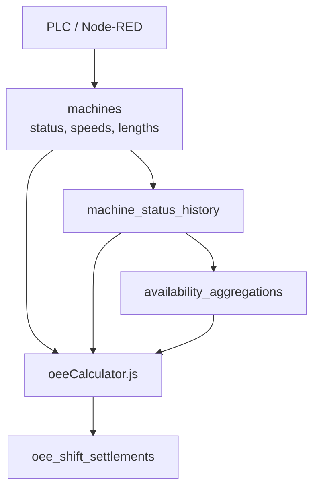
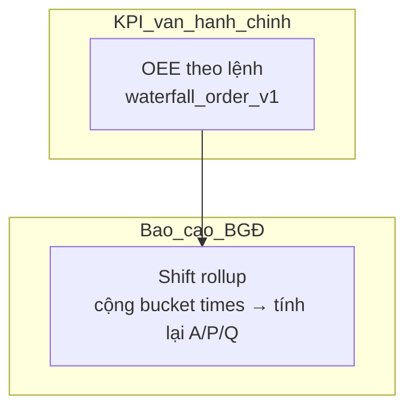
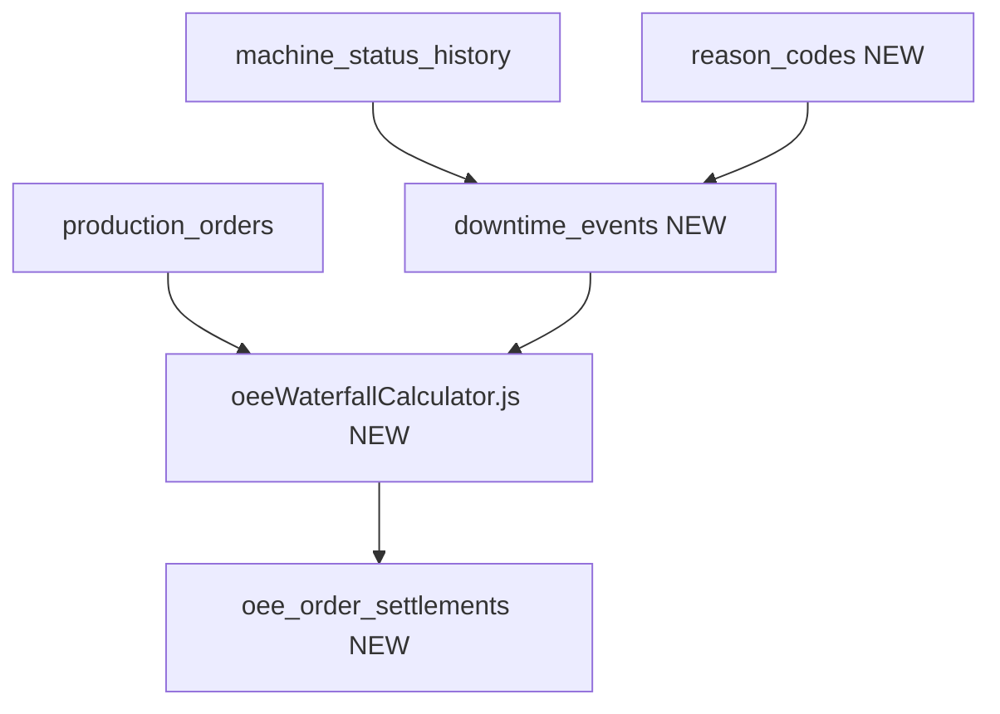
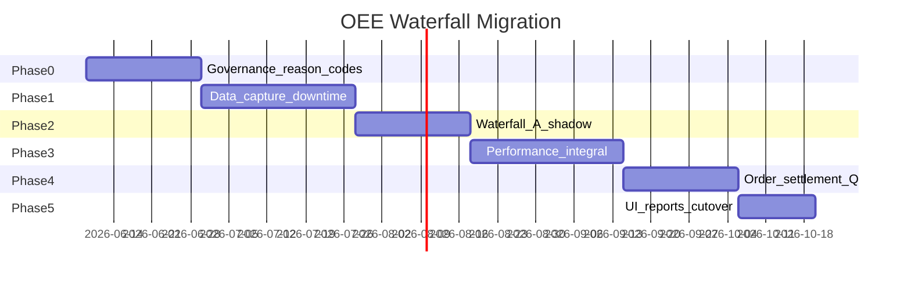

# Kịch bản chuyển OEE sang mô hình Waterfall (TPM) — POT theo lệnh sản xuất

Tài liệu trao đổi nội bộ: làm rõ phương pháp OEE theo slide TPM (waterfall thời gian), so sánh với implementation hiện tại, và **kịch bản triển khai** cho các phase sắp tới.

**Trạng thái:** Draft trao đổi — chờ TP MES / SX / QM chốt quyết định  
**Phiên bản:** 1.0  
**Liên kết:** [oee-rulebook-realtime-vs-settled.md](./oee-rulebook-realtime-vs-settled.md) · [OEE_GAP_ANALYSIS_AVEVA_HYDRA.md](./OEE_GAP_ANALYSIS_AVEVA_HYDRA.md) · [OEE_EXECUTIVE_BRIEF_TP_MES.md](./OEE_EXECUTIVE_BRIEF_TP_MES.md)

---

## Mục lục

1. [Tóm tắt điều hành](#1-tóm-tắt-điều-hành)
2. [Quyết định đã chốt trong trao đổi](#2-quyết-định-đã-chốt-trong-trao-đổi)
3. [Mô hình mục tiêu — Waterfall thời gian](#3-mô-hình-mục-tiêu--waterfall-thời-gian)
4. [Baseline hiện tại trong hệ thống](#4-baseline-hiện-tại-trong-hệ-thống)
5. [So sánh sâu A / P / Q](#5-so-sánh-sâu-a--p--q)
6. [POT theo lệnh sản xuất — chính sách dual-grain](#6-pot-theo-lệnh-sản-xuất--chính-sách-dual-grain)
7. [Phân loại loss và reason-code](#7-phân-loại-loss-và-reason-code)
8. [Kiến trúc dữ liệu và API đề xuất](#8-kiến-trúc-dữ-liệu-và-api-đề-xuất)
9. [Kịch bản số minh họa](#9-kịch-bản-số-minh-họa)
10. [Ma trận GAP và blocker](#10-ma-trận-gap-và-blocker)
11. [Lộ trình triển khai chi tiết](#11-lộ-trình-triển-khai-chi-tiết)
12. [Tiêu chí nghiệm thu từng phase](#12-tiêu-chí-nghiệm-thu-từng-phase)
13. [Rủi ro và mitigations](#13-rủi-ro-và-mitigations)
14. [Câu hỏi mở — cần chốt trước cutover](#14-câu-hỏi-mở--cần-chốt-trước-cutover)
15. [Phụ lục — file nguồn và glossary](#15-phụ-lục--file-nguồn-và-glossary)

---

## 1. Tóm tắt điều hành

Hệ thống **đã có** nền tảng OEE (`A × P × Q`, shift-based, status history, settlement ca). Tuy nhiên, cách tính hiện tại **không** phản ánh đầy đủ mô hình waterfall trong tài liệu TPM nội bộ (slide OEE + Availability):

| Khía cạnh | Hiện tại | Mục tiêu waterfall |
|-----------|----------|-------------------|
| Đơn vị thời gian chính | Ca 8 giờ | **Lệnh sản xuất** (`start_time` → `end_time`) |
| Lớp Planned Shutdown (PST) | Không có | Chỉ *No order* + *Preventive maintenance* |
| Ngưỡng 5 phút | Chỉ đếm trong analytics | **Phân nhánh Availability vs Performance** |
| Đổi khuôn / đổi màu | `setup` → downtime A (mọi độ dài) | **DTL** (downtime loss), không phải PST |
| Performance | Tốc độ tức thời `line_speed / target_speed` | **Tích phân thời gian** trên Operating Time |
| Phân loại loss | 6 status PLC | **Reason-code** + Six Big Losses có governance |

**Thông điệp cốt lõi:** Chuyển methodology **không phải** sửa vài dòng trong `oeeCalculator.js`. Cần xây **lớp capture sự kiện dừng có lý do**, **segmenter 5 phút**, và **settlement theo lệnh** trước khi thay KPI chính thức.

**Ước lượng độ sẵn sàng code:** ~30% (công thức tổng, order timestamps, quality length, status history). ~70% còn lại là dữ liệu + phân loại + grain mới.

---

## 2. Quyết định đã chốt trong trao đổi

Các mục sau đã được chọn trong phiên trao đổi kịch bản (có thể điều chỉnh khi ban hành):

| # | Quyết định | Giá trị đã chọn |
|---|------------|-----------------|
| D1 | Phạm vi methodology | **Full waterfall** — PST → PPT → DTL (>5 phút) → OT → Speed loss → Quality loss |
| D2 | Định nghĩa POT | **Theo lệnh SX** — không dùng ca làm mốc gốc cho KPI vận hành chính |
| D3 | Công thức tổng | Giữ `OEE = Availability × Performance × Quality` (%, 0–100 mỗi thành phần) |
| D4 | Báo cáo BGĐ theo ca | **Dual-grain** — rollup ca từ các lệnh đã settled trong ca (không trung bình % đơn giản) |

**Chưa chốt** (xem [§14](#14-câu-hỏi-mở--cần-chốt-trước-cutover)): startup rejects thuộc A hay Q; fallback khi thiếu reason; tích hợp lịch PM từ SAP; sub-period cho lệnh dài nhiều ngày.

---

## 3. Mô hình mục tiêu — Waterfall thời gian

### 3.1 Sơ đồ thời gian (theo slide)

```mermaid
flowchart LR
  POT["POT\nPlant Operating Time\norder start → end"]
  PST["PST\nPlanned Shutdown\nNo order + PM only"]
  PPT["PPT\nPlanned Production Time\nPOT - PST"]
  DTL["DTL\nDowntime Loss\nstop > 5 phút"]
  OT["OT\nOperating Time\nPPT - DTL"]
  SL["Speed Loss\nchậm tốc độ + small stops"]
  NOTime["Net Operating Time\nOT - speed loss time"]
  QL["Quality Loss\nNG + rework"]
  FPT["Fully Productive Time\nNet OT - quality loss"]

  POT --> PST
  PST --> PPT
  PPT --> DTL
  DTL --> OT
  OT --> SL
  SL --> NOTime
  NOTime --> QL
  QL --> FPT
```



### 3.2 Công thức thành phần

| Thành phần | Công thức | Mẫu số / tử số |
|------------|-----------|----------------|
| **Availability** | `OT / PPT × 100` | OT = thời gian thực sự chạy SX sau khi trừ DTL |
| **Performance** | `Net OT / OT × 100` | Tương đương tích phân tốc độ thực / tốc độ chuẩn trên OT |
| **Quality** | `FPT / Net OT × 100` | ≈ `Good / Total` khi đơn vị đo thống nhất (mét, kg, pcs) |
| **OEE** | `A × P × Q` | Hoặc tương đương `FPT / PPT` khi loss được tách đúng |

### 3.3 Quy tắc nghiệp vụ đặc trưng (slide Availability)

**Planned Shutdown (PST) — chỉ hai loại:**

- **No order** — không có lệnh sản xuất (planning).
- **Preventive maintenance** — bảo trì phòng ngừa có kế hoạch.

**Không thuộc PST (quan trọng):**

- Thay khuôn, đổi màu, đổi sản phẩm → **Downtime Loss (DTL)** nếu dừng **> 5 phút**.
- Mục đích: giữ “toàn cảnh mọi tổn thất” trong OEE, không “ẩn” changeover khỏi KPI.

**Downtime Loss (DTL):**

- Mọi sự kiện làm **dừng sản xuất kế hoạch > 5 phút (300 giây)**.
- Ví dụ slide: hỏng máy, hỏng khuôn, đổi khuôn/màu, startup rejects (nếu là dừng dài — cần chốt §14).

**Small stops (< 5 phút):**

- **Không** trừ vào Availability.
- Tính vào **Speed loss** → ảnh hưởng **Performance**.

**Khuyến nghị KPI operator (slide):**

- Nếu OEE dùng cho thưởng vận hành → cân nhắc hiển thị **`Performance × Quality`** tách riêng, vì Availability (hỏng máy, PM) thường nằm ngoài tầm kiểm soát trực tiếp của operator.

---

## 4. Baseline hiện tại trong hệ thống

### 4.1 Luồng tính OEE đang chạy



### 4.2 Công thức code hiện tại

| Thành phần | Implementation | File |
|------------|----------------|------|
| Availability | `running_seconds / planned_shift_seconds` — mọi status ≠ `running` là downtime | `backend/src/services/oeeCalculator.js` |
| Performance | `line_speed / target_speed`, cap 100%; thiếu target → **100%** + cờ | Cùng file |
| Quality | `ok / (ok + ng)`; chưa NG → 100% + `ASSUMED_100_PENDING_NG_INTEGRATION` | Cùng file |
| OEE | `(A × P × Q) / 10000` | Cùng file |
| Settlement | Grain **ca** (`oeeSettlementService.js`), `methodology_version = rollup_v1` | `backend/src/services/oeeSettlementService.js` |

### 4.3 Taxonomy trạng thái PLC (duy nhất đang drive OEE)

| Status | Operating time? | Ghi chú |
|--------|-----------------|---------|
| `running` | Có | Duy nhất được tính operating |
| `idle` | Không | Downtime A |
| `warning` | Không | Downtime A |
| `error` | Không | Downtime A; analytics → Equipment Failure |
| `stopped` | Không | Downtime A |
| `setup` | Không | Downtime A; analytics → Setup & Adjustments |

**Không có** trong DB triển khai: `reason_codes`, `downtime_events`, `production_events` (chỉ có trong docs kiến trúc).

### 4.4 Điểm lệch so với rulebook đã ban hành

Rulebook [oee-rulebook-realtime-vs-settled.md](./oee-rulebook-realtime-vs-settled.md) đã chốt policy **realtime vs settled** và Quality phase chưa NG. Tài liệu này **bổ sung** layer waterfall + grain order — **mở rộng** rulebook, chưa thay thế §3 công thức TPM cơ bản.

| Rulebook | Code hiện tại | Waterfall mục tiêu |
|----------|---------------|-------------------|
| Settled P thiếu target → `null` | P = 100% + cờ | **null** (bắt buộc khi cutover) |
| Không vay ca trước (settled) | Realtime vay ca nếu A < 10% | Tách methodology; settled order không vay |
| Grain order (P2 roadmap) | Chỉ shift | **Order primary** |

---

## 5. So sánh sâu A / P / Q

### 5.1 Availability — thay đổi có tác động lớn nhất

#### Công thức mục tiêu (order window)

```
POT_sec  = epoch(order_end) - epoch(order_start)     # order đang chạy: end = now
PST_sec  = sum(duration WHERE reason IN PST_SET AND approved)
PPT_sec  = POT_sec - PST_sec
DTL_sec  = sum(duration WHERE reason IN DTL_SET AND duration > 300)
OT_sec   = PPT_sec - DTL_sec
A_pct    = clamp(OT_sec / PPT_sec * 100, 0, 100)
```

**PST_SET (đề xuất ban đầu):** `NO_WORK_ORDER`, `PREVENTIVE_MAINTENANCE`  
**DTL_SET (theo slide + mở rộng từ reason catalog):** `MECH_FAIL`, `MOLD_FAIL`, `MOLD_CHANGE`, `COLOR_CHANGE`, `MAT_CHANGE`, `CHANGEOVER`, `STARTUP_REJECT` (chờ chốt), …

#### Bảng tác động hành vi

| Tình huống | Cách cũ (status-only) | Waterfall order |
|------------|----------------------|-----------------|
| 10 lần dừng 2 phút | A giảm ~20 phút / planned | A **không đổi**; P giảm (speed loss) |
| Đổi khuôn 45 phút (`setup`) | Trừ 45 phút khỏi A | Trừ 45 phút DTL khỏi PPT → **tương tự** nếu > 5 phút |
| PM có lịch 2h trong lệnh | Trừ 2h khỏi A | **Loại 2h khỏi PPT** (PST) → A không bị phạt |
| Dừng 4 phút | Trừ A | **Không trừ A** → speed loss |
| Không có reason-code | Mọi non-running = downtime | **Không phân PST/DTL** → cần fallback + DQ flag |

#### Thuật toán segmenter (đề xuất kỹ thuật)

1. Lấy `machine_status_history` clip trong `[order.start_time, order.end_time | now]`.
2. Merge các segment non-running liên tiếp (cùng hoặc khác status).
3. Với mỗi segment:
   - Nếu `duration ≤ 300s` → **speed_loss_bucket** (trừ khi reason PST).
   - Nếu `duration > 300s` → tra `reason_code`:
     - ∈ PST_SET → cộng PST.
     - ∈ DTL_SET hoặc unknown → cộng DTL.
4. `OT = PPT - DTL` (thời gian còn lại trong PPT không thuộc DTL; running time xác nhận chéo).

**Shadow mode (Phase 2):** Tính song song `A_shift_v1` và `A_waterfall_order_v1`, lưu diff vào bảng audit — **không đổi UI chính** cho đến khi TP phê duyệt cutover.

### 5.2 Performance — từ điểm tức thời sang tích phân thời gian

#### Định nghĩa mục tiêu

```
P_pct = Net_OT_sec / OT_sec × 100
```

Tương đương khi có target speed theo lệnh:

```
Net_OT_sec ≈ ∫ over OT of min(1, actual_speed(t) / target_speed) dt
```

Hoặc theo sản lượng:

```
P_pct = (ideal_output_during_OT / actual_output_during_OT) × 100
```

#### So với code hiện tại

```javascript
// backend/src/services/oeeCalculator.js — hiện tại
performance = (actualSpeed / targetSpeed) * 100  // một điểm tức thời
// thiếu target → performance = 100 (KHÔNG phù hợp settled)
```

#### Nguồn dữ liệu đề xuất cho tích phân

| Nguồn | Ưu điểm | Rủi ro |
|-------|---------|--------|
| `machine_metrics` (speed, 30s) | Phản ánh dao động tốc độ | Cần đủ mật độ; đã có hướng dẫn 30s sampling |
| `production_length_events.delta_length` | Gắn sản lượng thực | Chưa dùng trong P hiện tại; cần đồng bộ thời gian |
| Snapshot `machines.line_speed` | Đơn giản | **Không đủ** cho waterfall đúng nghĩa |

#### Target speed theo lệnh

- Ưu tiên: master data **theo sản phẩm / recipe / lệnh** (`production_orders` + bảng rated speed).
- Fallback: `machines.target_speed` (snapshot) — gắn cờ `ESTIMATED_TARGET`.
- Settled: không có target hợp lệ ≥ 95% OT → `performance_settled_pct = null` (rulebook §5.2).

#### Minor stops trong P

Thời gian non-running **≤ 300s** trong cửa sổ OT (hoặc running nhưng speed = 0 / dưới ngưỡng) → cộng vào **speed_loss_sec**, trừ khỏi Net OT.

### 5.3 Quality — tương đối gần chuẩn, cần chốt nghiệp vụ

#### Công thức

```
Q_pct = Good / Total × 100
     ≈ FPT_sec / Net_OT_sec   (khi quy đổi đơn vị thời gian ↔ sản lượng)
```

#### Phase hiện tại (chưa tích hợp NG đầy đủ)

Theo rulebook: `quality = 100%` + cờ `ASSUMED_100_PENDING_NG_INTEGRATION` — **vẫn áp dụng** trong giai đoạn chuyển đổi cho đến khi có kênh NG tin cậy.

#### Điểm cần QM chốt

| Chủ đề | Slide / TPM | Hành động đề xuất |
|--------|-----------|-------------------|
| Startup rejects | Slide Availability: thuộc DTL | Tách reason `STARTUP_REJECT`; scrap khởi động không vào Q nếu policy chốt A |
| Rework | Quality loss | Reason `REWORK` → trừ Q, không trừ A |
| Process defects | Quality loss | OK/NG từ QC |
| Order scope | Cả A/P/Q cùng order window | Quality đã filter `production_order_id` một phần; A/P phải đồng bộ |

---

## 6. POT theo lệnh sản xuất — chính sách dual-grain

### 6.1 Định nghĩa POT

Bảng `production_orders` đã có:

```sql
start_time TIMESTAMP NOT NULL,
end_time TIMESTAMP,
status order_status NOT NULL DEFAULT 'running',
```

| Trạng thái lệnh | POT (cửa sổ tính OEE) |
|-----------------|------------------------|
| `running` | `[start_time, now()]` |
| `completed` / `closed` | `[start_time, end_time]` |

**Lệnh kéo dài nhiều ca:** một chuỗi OEE liên tục — **không cắt** tại ranh giới 06:00 / 14:00 / 22:00.

### 6.2 Dual-grain — hai “lăng kính” KPI



| Grain | Mục đích | Ai dùng |
|-------|----------|---------|
| **Production order** | Điều hành line, đối soát theo lệnh, Pareto loss theo sản phẩm | Tổ trưởng, planner, QM |
| **Shift** | Báo cáo ca/ngày BGĐ, so sánh ca | Quản lý xưởng, BGĐ |

**Rollup ca đúng cách (rulebook §6.4):**

```
# KHÔNG làm:
OEE_shift = average(OEE_order_1, OEE_order_2)

# NÊN làm:
PPT_shift = sum(PPT_order_i)
OT_shift  = sum(OT_order_i)
A_shift   = OT_shift / PPT_shift * 100
# Tương tự cho Good/Total và ideal/actual output → P, Q
```

### 6.3 Khoảng “không có lệnh”

Giữa hai lệnh (máy idle, không order):

- **Không** có OEE order.
- Báo cáo ca vẫn có thể hiển thị **machine utilization** hoặc PST `NO_WORK_ORDER` nếu capture được — đây là KPI phụ, không nhân vào OEE lệnh.

### 6.4 PST “No order” trong cửa sổ lệnh

Khi đã gán lệnh, PST loại **No order** trong POT lệnh **≈ 0**. PST thực tế trong order chủ yếu là **PM có lịch** xen kẽ. Cần tích hợp lịch bảo trì hoặc workflow phê duyệt PM trên tablet.

---

## 7. Phân loại loss và reason-code

### 7.1 Ba lớp loss trong waterfall

| Lớp | Bucket code | Ảnh hưởng | Ví dụ |
|-----|-------------|-----------|-------|
| Schedule loss | `PST` | Giảm PPT (mẫu số A) | No order, PM |
| Availability loss | `DTL` | Giảm OT | Hỏng máy, đổi khuôn > 5 phút |
| Speed loss | `SPEED` | Giảm Net OT | Chậm tốc độ, dừng < 5 phút |
| Quality loss | `QUALITY` | Giảm FPT | NG, rework |

### 7.2 Mapping đề xuất — reason_code → bucket

Kế thừa draft [MES_TAG_NAMING_STANDARD.md](../architecture/MES_TAG_NAMING_STANDARD.md) §5.3–5.4, bổ sung cột `waterfall_bucket`:

| code | Mô tả | waterfall_bucket | Ghi chú |
|------|-------|------------------|---------|
| `NO_WORK_ORDER` | Không có lệnh | **PST** | Chỉ khi không có order active |
| `PREVENTIVE_MAINTENANCE` | Bảo trì phòng ngừa | **PST** | Cần flag approved / lịch |
| `MECH_FAIL` | Hỏng cơ khí | **DTL** | Nếu > 5 phút |
| `ELEC_FAULT` | Hỏng điện | **DTL** | Nếu > 5 phút |
| `MOLD_CHANGE` | Thay khuôn | **DTL** | Slide: không phải PST |
| `COLOR_CHANGE` | Đổi màu | **DTL** | Slide: không phải PST |
| `MAT_CHANGE` | Đổi vật tư | **DTL** | |
| `CHANGEOVER` | Đổi sản phẩm / setup | **DTL** | Map từ PLC `setup` |
| `STARTUP_REJECT` | Phế khởi động | **DTL** hoặc **QUALITY** | **Chờ chốt §14** |
| `REWORK` | Làm lại | **QUALITY** | |
| `REDUCED_SPEED` | Chạy chậm | **SPEED** | |
| `BREAK_TIME` | Nghỉ | **PST** hoặc **DTL** | **Chờ TP** — có tính vào OEE không? |
| `WAIT_MAT` | Chờ nguyên liệu | **DTL** | Thường > 5 phút |

### 7.3 Giai đoạn chuyển tiếp — heuristic từ PLC status

Khi chưa có tablet reason, dùng mapping tạm (cờ `INFERRED_REASON`):

| PLC status | Reason tạm | Bucket nếu > 5 phút |
|------------|------------|---------------------|
| `error`, `stopped` | `MECH_FAIL` | DTL |
| `setup` | `CHANGEOVER` | DTL |
| `idle` | `NO_WORK_ORDER` hoặc `WAIT_MAT` | PST hoặc DTL — **mơ hồ, cần reason thật** |
| `warning` | `REDUCED_SPEED` | SPEED nếu ≤ 5 phút; DTL nếu > 5 phút |

**Cảnh báo:** Heuristic **không đủ** cho KPI chính thức lâu dài — chỉ dùng shadow mode và backfill.

### 7.4 Six Big Losses (báo cáo Pareto)

Song song `waterfall_bucket`, giữ `six_big_loss_category` cho dashboard analytics:

| Six Big Loss | Nguồn waterfall |
|--------------|-----------------|
| Equipment Failure | DTL — MECH_FAIL, ELEC_FAULT, … |
| Setup & Adjustments | DTL — CHANGEOVER, MOLD_CHANGE, … |
| Idling & Minor Stops | SPEED — stops < 5 phút |
| Reduced Speed | SPEED — REDUCED_SPEED |
| Process Defects | QUALITY |
| Reduced Yield | QUALITY / DTL (startup — chờ chốt) |

---

## 8. Kiến trúc dữ liệu và API đề xuất

### 8.1 Sơ đồ thự thể



### 8.2 Bảng mới (tối thiểu)

#### `reason_codes`

| Cột | Kiểu | Mô tả |
|-----|------|-------|
| `code` | VARCHAR(50) PK | `MECH_FAIL`, … |
| `category` | VARCHAR(50) | Machine, Material, … |
| `waterfall_bucket` | VARCHAR(20) | `PST`, `DTL`, `SPEED`, `QUALITY` |
| `six_big_loss_category` | VARCHAR(50) | TPM category |
| `requires_approval` | BOOLEAN | PM, break đã duyệt |
| `description_vi` | VARCHAR(255) | |

#### `downtime_events`

| Cột | Kiểu | Mô tả |
|-----|------|-------|
| `id` | SERIAL PK | |
| `machine_id` | VARCHAR(50) FK | |
| `production_order_id` | VARCHAR(100) FK | Nullable nếu no order |
| `start_time` | TIMESTAMPTZ | |
| `end_time` | TIMESTAMPTZ | |
| `duration_seconds` | INTEGER | Generated / stored |
| `reason_code` | VARCHAR(50) FK | |
| `source` | VARCHAR(20) | `PLC`, `TABLET`, `INFERRED` |
| `data_quality` | VARCHAR(30) | `OK`, `INFERRED_REASON`, … |

#### `oee_order_settlements`

| Cột | Kiểu | Mô tả |
|-----|------|-------|
| `production_order_id` | VARCHAR(100) | PK part |
| `machine_id` | VARCHAR(50) | PK part |
| `methodology_version` | VARCHAR(30) | `waterfall_order_v1` |
| `period_start`, `period_end` | TIMESTAMPTZ | |
| `pot_sec` … `fpt_sec` | INTEGER | Waterfall audit buckets |
| `availability_settled_pct` | DECIMAL(5,2) | |
| `performance_settled_pct` | DECIMAL(5,2) | |
| `quality_settled_pct` | DECIMAL(5,2) | |
| `oee_settled_pct` | DECIMAL(5,2) | |
| `data_quality_flags` | JSONB | |
| `settled_at` | TIMESTAMPTZ | Immutable |

### 8.3 API đề xuất (bổ sung, không phá vỡ API cũ)

| Endpoint | Mô tả |
|----------|-------|
| `GET /api/oee/orders/:orderId/waterfall` | Realtime waterfall buckets + A/P/Q |
| `GET /api/oee/orders/:orderId/settled` | Snapshot sau khi order closed |
| `GET /api/oee/shifts/:shiftId/rollup` | Rollup từ order settlements trong ca |
| `GET /api/oee/compare?orderId=&legacy=true` | Shadow: `shift_v1` vs `waterfall_order_v1` |

**Response mẫu (rút gọn):**

```json
{
  "success": true,
  "data": {
    "methodology_version": "waterfall_order_v1",
    "production_order_id": "PO-2026-001",
    "time_buckets_sec": {
      "pot": 14400,
      "pst": 1800,
      "ppt": 12600,
      "dtl": 2700,
      "ot": 9900,
      "speed_loss": 1200,
      "net_ot": 8700,
      "quality_loss": 0,
      "fpt": 8700
    },
    "availability_pct": 78.57,
    "performance_pct": 87.88,
    "quality_pct": 100,
    "oee_pct": 69.08,
    "data_quality_flags": {
      "quality": "ASSUMED_100_PENDING_NG_INTEGRATION"
    }
  }
}
```

### 8.4 Service tách biệt

| Service | Vai trò |
|---------|---------|
| `oeeCalculator.js` | Giữ `shift_v1` cho tương thích ngược |
| `oeeWaterfallCalculator.js` | **Mới** — toàn bộ logic PST/PPT/DTL/5 phút/order |
| `oeeRollupService.js` | Mở rộng rollup ca từ order buckets |
| `oeeOrderSettlementService.js` | **Mới** — settle khi order `completed` |

---

## 9. Kịch bản số minh họa

### 9.1 Lệnh 4 giờ — có PM và đổi khuôn

**Giả định:**

- POT = 4h = 14 400s  
- PST = 30 phút PM = 1 800s  
- DTL = 45 phút đổi khuôn = 2 700s  
- Minor stops = 20 phút = 1 200s (trong OT, thuộc speed loss)  
- Target speed đạt 90% phần còn lại của OT  

| Bước | Tính toán | Kết quả |
|------|-----------|---------|
| PPT | 14 400 − 1 800 | 12 600s (3h30) |
| OT | 12 600 − 2 700 | 9 900s (2h45) |
| **A** | 9 900 / 12 600 | **78,6%** |
| Net OT | 9 900 − 1 200 | 8 700s |
| **P** | 8 700 / 9 900 | **87,9%** |
| **Q** | (giả định 100% chưa NG) | **100%** |
| **OEE** | 78,6 × 87,9 × 100 / 10 000 | **~69,1%** |

**So với cách cũ** (planned = 4h, non-running = 75 phút DTL + 20 phút minor = 95 phút):

- A_cũ = (14 400 − 5 700) / 14 400 = **60,4%** — thấp hơn vì minor stops trừ vào A.

**Bài học:** Waterfall **tách** trách nhiệm loss — A phản ánh downtime dài; P phản ánh dừng ngắn và chậm tốc độ.

### 9.2 Một ca có hai lệnh ngắn

| Lệnh | PPT | OT | A |
|------|-----|-----|---|
| A | 2h | 1h50 | 91,7% |
| B | 1h30 | 1h00 | 66,7% |

**Sai:** `A_shift = (91,7 + 66,7) / 2 = 79,2%`  
**Đúng:** PPT = 3h30, OT = 2h50 → **A_shift = 81,0%**

---

## 10. Ma trận GAP và blocker

| ID | Hạng mục | Mức | Blocker? | Ghi chú |
|----|----------|-----|----------|---------|
| G1 | Grain POT = order | Cao | Có | Settlement, UI shift-first |
| G2 | PST layer | Cao | Có | Cần reason + PM workflow |
| G3 | DTL ngưỡng 5 phút | Cao | Có | Segmenter chưa có |
| G4 | Minor stop → P | Cao | Có | Đảo logic A hiện tại |
| G5 | Performance tích phân | TB–Cao | Một phần | Cần `machine_metrics` đủ mật độ |
| G6 | Reason-code governance | Cao | Có | Chỉ có trong docs |
| G7 | Dual-grain shift rollup | TB | Không | Cần spec rollup đúng |
| G8 | Realtime vay ca trước | TB | Không | Tắt cho waterfall settled |
| G9 | Startup rejects | TB | Một phần | Chờ QM |
| G10 | Docs vs code | Thấp | Không | Rolling 10 phút vs shift |

---

## 11. Lộ trình triển khai chi tiết

### Tổng quan timeline



### Phase 0 — Governance (2–3 tuần)

**Mục tiêu:** Chốt “luật chơi” trước khi viết code calculator mới.

| Deliverable | Owner đề xuất |
|-------------|---------------|
| Bảng `reason_codes` v1.0 (Excel + SQL seed) | TP MES + SX |
| Bảng mapping `waterfall_bucket` + Six Big Losses | TP MES |
| Quyết định startup rejects, BREAK_TIME | QM + TP |
| Chính sách dual-grain (order primary, shift report) | BGĐ + TP |
| Cập nhật rulebook §6.3 losses (tham chiếu file này) | MES IT |

**Không code** trong phase này ngoài seed reason_codes nếu đã chốt.

### Phase 1 — Data capture (3–4 tuần)

**Mục tiêu:** Có `downtime_events` tin cậy gắn `production_order_id`.

| Task | Chi tiết |
|------|----------|
| Migration DB | `reason_codes`, `downtime_events` |
| Tablet | Chọn reason khi dừng > N phút (N có thể 1 phút để capture, bucket 5 phút tính sau) |
| PLC | Map `setup` / `stopped` → tạo event draft |
| Backfill job | Từ `machine_status_history` → events với `source=INFERRED` |
| Liên kết order | Mọi event trong cửa sổ lệnh có `production_order_id` |

### Phase 2 — Waterfall Availability shadow (2–3 tuần)

**Mục tiêu:** `oeeWaterfallCalculator` tính POT/PST/PPT/DTL/OT/A; so sánh với cũ.

| Task | Chi tiết |
|------|----------|
| `oeeWaterfallCalculator.js` | Segmenter + bucket audit |
| API compare | `/api/oee/compare` |
| DQ flags | `INFERRED_REASON`, `INCOMPLETE_DOWNTIME_DATA` |
| Dashboard nội bộ | Chỉ admin/TP — chưa đổi KPI công khai |

### Phase 3 — Performance tích phân (3–4 tuần)

**Mục tiêu:** P trên OT từ time series; target theo lệnh.

| Task | Chi tiết |
|------|----------|
| Tích phân speed | `machine_metrics` 30s trên OT |
| Target master | Rated speed theo product/order |
| Settled policy | P = null khi thiếu target (sửa code settlement) |
| Minor stops | Gộp vào speed_loss_sec |

### Phase 4 — Quality + Order settlement (2–3 tuần)

**Mục tiêu:** Immutable `oee_order_settlements` khi order đóng.

| Task | Chi tiết |
|------|----------|
| Trigger settle | Order → `completed` / `closed` |
| Shift rollup | Cộng buckets từ orders trong ca |
| NG integration | Khi sẵn sàng — thay policy 100% giả định |
| Startup rejects | Áp dụng quyết định Phase 0 |

### Phase 5 — UI & cutover (2 tuần)

**Mục tiêu:** Dashboard chính thức dùng waterfall order; báo cáo ca rollup.

| Task | Chi tiết |
|------|----------|
| Waterfall chart | POT → FPT trên Equipment Detail |
| Toggle methodology | `shift_v1` / `waterfall_order_v1` (ẩn dần cũ) |
| Operator KPI | Hiển thị P×Q |
| Đào tạo | SX + vận hành — giải thích A ca ≠ A lệnh |

### Song song — P0 từ GAP analysis (không chờ waterfall)

Các hạng mục sau **nên làm ngay**, độc lập waterfall:

1. Settled Performance thiếu target → `null` (không 100%).
2. Cờ Quality + UI chú thích phase chưa NG.
3. Tách realtime vs settled trên API/dashboard.
4. Đồng bộ docs shift-based.

---

## 12. Tiêu chí nghiệm thu từng phase

| Phase | Tiêu chí “xong” |
|-------|-----------------|
| **0** | TP ký bảng reason_codes; file mapping published; 3 quyết định §14 đã có owner |
| **1** | ≥ 80% downtime > 5 phút có `reason_code` (tablet hoặc inferred); 0 event mồ côi không `machine_id` |
| **2** | Shadow chạy 2 tuần; báo cáo diff A: median / p95 chênh lệch có giải trình; không crash API |
| **3** | P_waterfall tương quan với tích phân tay trên ≥ 5 lệnh mẫu (sai số < 2%) |
| **4** | Order settled immutable; rollup ca khớp tổng bucket ± 1% |
| **5** | UAT SX + QM; BGĐ nhận báo cáo ca 1 tuần pilot |

---

## 13. Rủi ro và mitigations

| Rủi ro | Tác động | Mitigation |
|--------|----------|------------|
| Operator không chọn reason | PST/DTL sai | Bắt buộc reason sau 5 phút; default `UNKNOWN` + không settle |
| A tăng đột biến sau cutover | Tranh cãi KPI | Shadow 4–6 tuần; đào tạo; giữ `shift_v1` song song |
| Lệnh multi-day “loãng” OEE | Khó điều hành realtime | Sub-period “ca trong lệnh” (KPI phụ) |
| Thiếu lịch PM | PST = 0 | Tích hợp SAP PM hoặc manual approve trên tablet |
| Metrics thưa | P sai | Enforce 30s sampling; DQ `SPARSE_METRICS` |
| Hai số OEE cùng lúc | BGĐ confused | Label rõ methodology_version trên mọi widget |

---

## 14. Câu hỏi mở — cần chốt trước cutover

| # | Câu hỏi | Phương án | Quyết định |
|---|---------|-----------|------------|
| Q1 | Startup rejects thuộc **A (DTL)** hay **Q**? | A: DTL / B: Quality loss | _Chưa chốt_ |
| Q2 | `BREAK_TIME` đã TP duyệt → PST hay DTL? | A: PST / B: DTL / C: Loại khỏi OEE | _Chưa chốt_ |
| Q3 | Fallback khi thiếu reason (stop > 5 phút)? | A: DTL / B: UNKNOWN + no settle / C: status-only | _Chưa chốt_ |
| Q4 | Lệnh > 24h — có KPI “ca trong lệnh”? | A: Có / B: Không | _Chưa chốt_ |
| Q5 | Thời gian song song `shift_v1` vs waterfall? | Đề xuất: 4–6 tuần shadow + 2 tuần pilot | _Chưa chốt_ |
| Q6 | PM lịch từ SAP? | A: Phase 1 / B: Phase 2+ / C: Manual tablet | _Chưa chốt_ |

---

## 15. Phụ lục — file nguồn và glossary

### 15.1 File code chính

| File | Vai trò |
|------|---------|
| `backend/src/services/oeeCalculator.js` | OEE realtime shift_v1 |
| `backend/src/services/oeeRollupService.js` | Rollup ca/ngày |
| `backend/src/services/oeeSettlementService.js` | Settled shift |
| `backend/src/services/analyticsService.js` | Six Big Losses heuristic |
| `backend/database/migration_add_availability_aggregation.sql` | SQL availability |
| `backend/database/schema.sql` | `production_orders`, `machine_status_history` |

### 15.2 Tài liệu liên quan

| Tài liệu | Nội dung |
|----------|----------|
| [oee-rulebook-realtime-vs-settled.md](./oee-rulebook-realtime-vs-settled.md) | Realtime vs settled, DQ flags |
| [OEE_GAP_ANALYSIS_AVEVA_HYDRA.md](./OEE_GAP_ANALYSIS_AVEVA_HYDRA.md) | GAP tổng thể |
| [OEE_EXECUTIVE_BRIEF_TP_MES.md](./OEE_EXECUTIVE_BRIEF_TP_MES.md) | Brief lãnh đạo |
| [MES_TAG_NAMING_STANDARD.md](../architecture/MES_TAG_NAMING_STANDARD.md) | reason_codes, downtime_events draft |

### 15.3 Glossary

| Thuật ngữ | Tiếng Anh | Ý nghĩa |
|-----------|-----------|---------|
| POT | Plant Operating Time | Tổng thời gian cửa sổ lệnh (order start → end) |
| PST | Planned Shutdown Time | Nghỉ có kế hoạch: no order, PM |
| PPT | Planned Production Time | POT − PST — mẫu số Availability |
| DTL | Downtime Loss | Dừng > 5 phút không thuộc PST |
| OT | Operating Time | PPT − DTL |
| Net OT | Net Operating Time | OT sau khi trừ speed loss |
| FPT | Fully Productive Time | Thời gian sản xuất hàng OK đạt tốc độ chuẩn |
| DQ | Data Quality | Cờ chất lượng dữ liệu KPI |

---

## Phê duyệt (điền khi ban hành)

| Vai trò | Họ tên | Ngày | Ghi chú |
|---------|--------|------|---------|
| TP MES | | | |
| Đại diện SX | | | |
| Đại diện QM | | | |
| IT/MES | | | |

**Mẫu HTML dashboard (dữ liệu thực từ DB):** [samples/oee-waterfall-demo.html](./samples/oee-waterfall-demo.html) — máy A-01, cửa sổ 8h 2026-01-09, 111 segment PLC.

**Phiên bản tài liệu:** 1.0 — Draft trao đổi kịch bản waterfall order-scoped.
